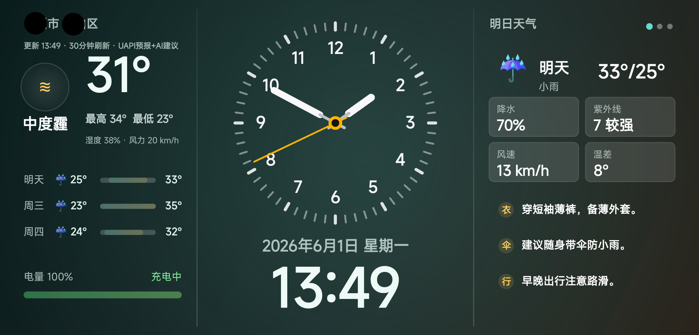

# Home Info Clock

<p align="center">
  
</p>

<p align="center">
  
</p>

一个横屏 Android 家庭信息钟。界面使用原生 `View` 绘制，适合作为旧手机、平板或常亮设备上的桌面信息屏。

当前界面包含三栏：

- 左栏：当前位置天气、天气趋势、电量状态。
- 中栏：苹果时钟风格模拟表盘、日期和数字时间。
- 右栏：明日天气、降水/紫外线/风速/温差，以及生活贴士。

## Features

- 原生 Android 自绘界面，不依赖 WebView。
- 横屏沉浸式显示，适合常亮 kiosk 场景。
- Android `LocationManager` 获取位置。
- UAPI 天气作为主要天气源。
- Open-Meteo 和 QWeather 作为天气兜底/增强路径。
- 可选接入 GPTsAPI，用 `gpt-5.4-nano` 为右栏贴士生成 AI 建议。
- 电量状态读取自 Android `ACTION_BATTERY_CHANGED`。
- 右栏支持滑动分页，目前包含明日天气、快捷入口和预留页。

## Screens

- Weather: 实时天气、三日趋势、电池状态。
- Clock: 模拟表盘、平滑秒针、日期和数字时间。
- Tomorrow: 明日指标和穿衣、带伞、出行建议。

## Requirements

- Android Studio 或命令行 Gradle。
- Android SDK。
- JDK 17。
- 一台 Android 设备或模拟器。

本仓库在本地使用的命令行工具位于 `.tools/`，该目录已被 `.gitignore` 忽略。你也可以直接使用自己系统中的 JDK、Android SDK 和 Gradle。

## Build

在 Android Studio 中打开项目，等待 Gradle Sync 完成后运行 `app` 配置即可。

命令行构建示例：

```powershell
$env:JAVA_HOME='D:\test\kiosk\.tools\jdk17\jdk-17.0.19+10'
$env:ANDROID_HOME='D:\test\kiosk\.tools\android-sdk'
$env:ANDROID_SDK_ROOT=$env:ANDROID_HOME
$env:Path="$env:JAVA_HOME\bin;$env:ANDROID_HOME\platform-tools;$env:Path"
.\.tools\gradle-8.9\bin\gradle.bat --no-daemon assembleDebug
```

生成的 debug APK：

```text
app\build\outputs\apk\debug\app-debug.apk
```

安装到已连接设备：

```powershell
.\.tools\android-sdk\platform-tools\adb.exe install -r app\build\outputs\apk\debug\app-debug.apk
```

## Configuration

本地配置放在 `local.properties`。这个文件包含密钥，已被 `.gitignore` 忽略，不应该提交到 GitHub。

### UAPI Weather

UAPI 是默认天气源。匿名访问也可以运行，但推荐配置 token 以获得更稳定额度：

```properties
UAPI_TOKEN=your_uapi_token
```

### GPTsAPI AI Tips

右栏贴士默认使用天气源或本地规则生成。配置 GPTsAPI 后，应用会在天气刷新后请求 AI 改写穿衣、带伞、出行三条建议：

```properties
GPTSAPI_API_KEY=your_gptsapi_key
```

默认配置：

```properties
GPTSAPI_BASE_URL=https://api.gptsapi.net/v1
GPTSAPI_MODEL=gpt-5.4-nano
```

GPTsAPI 请求失败、超时或返回格式异常时，应用会自动保留原有贴士，并且不会在天气来源中显示 `AI建议`。

### QWeather

QWeather 是可选完整预报源，支持 JWT 认证：

```properties
QWEATHER_API_HOST=your_api_host.qweatherapi.com
QWEATHER_JWT_PROJECT_ID=your_project_id
QWEATHER_JWT_KEY_ID=your_credential_key_id
QWEATHER_JWT_PRIVATE_KEY_FILE=private/qweather-ed25519-private.pem
```

也支持临时开发用 API key：

```properties
QWEATHER_API_KEY=your_api_key
QWEATHER_API_HOST=your_api_host.qweatherapi.com
```

## Security Notes

- 不要提交 `local.properties`。
- 不要把 GPTsAPI、UAPI、QWeather key 写进 README、issue、commit message 或截图。
- 当前实现适合个人自用 kiosk。若要公开分发 APK，建议把 AI 和天气密钥放到自己的后端，不要直接内置在客户端。

## Project Structure

```text
app/
  src/main/java/com/homepanel/clock/
    MainActivity.java      # 权限、定位、天气、AI 建议、应用入口
    HomePanelView.java     # 原生自绘 UI
  src/main/AndroidManifest.xml
ANDROID_APP.md            # Android 运行与配置补充说明
web/                      # 早期 Web 版本资源
```

## Development Notes

- UI 主体在 `HomePanelView` 中绘制。
- 天气获取、生活建议和 GPTsAPI 调用在 `MainActivity` 中处理。
- 右栏贴士先由天气源/本地规则生成，再尝试用 AI 覆盖。
- AI 至少成功应用一条建议时，左上角来源会追加 `+AI建议`。
- GPTsAPI 失败时保留原贴士作为补救结果。

## License

未指定。推送到公开仓库前请按你的计划补充许可证，例如 MIT、Apache-2.0 或保留所有权利。
